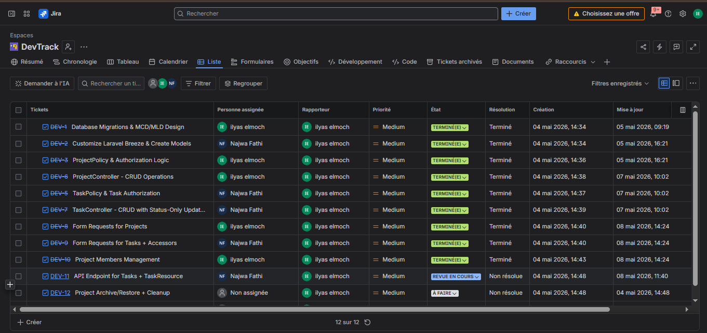

<div align="center">

# DevTrack

### A modern project & task management platform for development teams

*Inspired by Jira. Built with Laravel. Designed for real teams.*

[](https://laravel.com)
[](https://php.net)
[](https://mysql.com)
[](https://tailwindcss.com)
[](LICENSE)

</div>

---

## Overview

DevTrack was born out of a real problem at a startup in **Technopark Agadir** — where the team lead was juggling tasks across WhatsApp messages, Excel sheets, and scattered sticky notes. There was no single source of truth, deadlines were missed, and accountability was impossible to enforce.

**DevTrack fixes that.** It gives development teams a clean, role-aware platform to plan projects, assign tasks, track progress, and ship on time — without the noise of enterprise tools or the chaos of spreadsheets.

> Two roles. One dashboard. Full visibility.

- **Team Leads** own the full lifecycle: create projects, invite developers, assign tasks with priorities and deadlines, and monitor progress from a bird's-eye view.
- **Developers** get a focused workspace: their projects, their tasks, and the ability to move work forward by updating status — nothing more, nothing less.

---

## Table of Contents

- [User Roles](#user-roles)
- [Features](#features)
- [Tech Stack](#tech-stack)
- [Database Schema](#database-schema)
- [Project Structure](#project-structure)
- [Installation](#installation)
- [Usage](#usage)
- [API Reference](#api-reference)
- [Authorization Model](#authorization-model)
- [Technical Highlights](#technical-highlights)
- [Project Management](#project-management-jira)
- [Deliverables & Evaluation](#deliverables--evaluation)

---

## User Roles

DevTrack uses a **per-project role model** — the same user can be a lead on one project and a developer on another. Roles live in the `project_user` pivot table, keeping the system flexible without sacrificing control.

| Role | Capabilities |
|------|-------------|
| **Team Lead** | Create · Edit · Archive · Restore · Delete projects · Manage members · Full task CRUD · Assign tasks to developers |
| **Developer** | View projects they belong to · View assigned tasks · Update their own task status |

---

## Features

### Authentication & Profiles
- Secure registration, login, and logout via **Laravel Breeze**
- Email verification and password reset out of the box
- Profile management (name, email, password)

### Project Management
- **Dashboard** — visual project cards showing total tasks, completed tasks, and a live progress bar
- **Create / Edit / Delete** projects with a title, description, and deadline
- **Archive (Soft Delete)** — completed or paused projects disappear from the active dashboard but are preserved in the Archives, never lost
- **Restore** archived projects back to active with one click
- **Permanently delete** from the Archives page when a project is truly done (`forceDelete`)
- **Member management** — invite developers to a project by email, remove members, and protect the lead from accidental removal
- **Title auto-formatting** — project titles are stored with `ucfirst` automatically via an Eloquent mutator

### Task Management
- **Per-project task board** — every task shows its status, priority badge, assignee, and deadline urgency at a glance
- **Create tasks** with title, description, deadline, priority (`low` / `medium` / `high`), and an optional assignee
- **Full task editing** for leads — any field, any time
- **Status workflow**: `To Do` → `In Progress` → `Done` — developers can only advance their own assigned tasks
- **Urgency indicator** — tasks with a deadline within 48 hours are flagged automatically via the `urgent()` Eloquent scope
- **Delete tasks** — leads only, with confirmation

### REST API
- Expose project tasks as JSON for external integrations or mobile clients
- Full `TaskResource` transformer with computed fields like `status_label`, `priority_label`, and `deadline_status`

---

## Tech Stack

| Layer | Technology | Why |
|-------|-----------|-----|
| Backend | **Laravel 13** (PHP 8.3+) | Robust MVC framework with first-class ORM, policies, and form requests |
| Frontend | **Blade + Tailwind CSS** | Server-rendered views with utility-first styling — fast to build, easy to maintain |
| Database | **MySQL 8.0+** | Reliable relational storage with full support for soft deletes and pivot tables |
| Authentication | **Laravel Breeze** | Lightweight auth scaffolding — sessions, email verification, password reset |
| Authorization | **Laravel Policies** | Clean, testable gate logic completely decoupled from controllers |
| API | **Laravel API Resources** | Consistent JSON response shaping with computed accessors |
| Debugging | **Telescope + Debugbar** | Full request inspection and query profiling during development |
| Methodology | **Scrum** | Sprint planning, backlog grooming, and task tracking via Jira |
| Versioning | **Git / GitHub** | Feature branches, pull requests, and code reviews |

---

## Database Schema

### MCD — Conceptual Model


### MLD — Logical Model


### Table Definitions

```
users
  id · name · email (unique) · password · email_verified_at · remember_token · timestamps

projects
  id · title · description · deadline · created_by → users.id
  timestamps · deleted_at (soft delete)

tasks
  id · project_id → projects.id · assigned_to → users.id (nullable)
  title · description · deadline
  status   ENUM(todo | in_progress | done)   DEFAULT todo
  priority ENUM(low | medium | high)
  timestamps

project_user  (pivot)
  id · user_id → users.id · project_id → projects.id
  role ENUM(lead | developer) DEFAULT developer
  timestamps
  UNIQUE (user_id, project_id)
```

The `deleted_at` column on `projects` powers soft deletes — archived projects are never physically removed until a lead explicitly force-deletes them. The `project_user` pivot stores the per-project role, enabling one user to hold different roles across multiple projects.

---

## Project Structure

```
devtrack/
├── app/
│   ├── Http/
│   │   ├── Controllers/
│   │   │   ├── ProjectController.php       # Full project lifecycle: CRUD, archive, restore, members
│   │   │   ├── TaskController.php          # Task CRUD + status transitions
│   │   │   ├── Api/
│   │   │   │   └── TaskApiController.php   # Stateless JSON API endpoints
│   │   │   └── ProfileController.php
│   │   ├── Requests/
│   │   │   ├── StoreProjectRequest.php     # Validated project creation
│   │   │   ├── UpdateProjectRequest.php    # Validated project updates
│   │   │   ├── StoreTaskRequest.php        # Validated task creation
│   │   │   └── UpdateTaskRequest.php       # Validated task updates
│   │   └── Resources/
│   │       └── TaskResource.php            # API response transformer with computed fields
│   ├── Models/
│   │   ├── Project.php                     # SoftDeletes + ucfirst title mutator
│   │   ├── Task.php                        # Accessors (status_label, deadline_status) + urgent() scope
│   │   └── User.php
│   └── Policies/
│       ├── ProjectPolicy.php               # Lead-only mutations, member-based viewing
│       └── TaskPolicy.php                  # Lead CRUD, developer status-only
├── database/
│   └── migrations/
├── resources/views/
│   ├── layouts/                            # app.blade.php + responsive navigation
│   ├── projects/                           # index, create, show, edit, archived, members
│   ├── tasks/                              # index, create, show, edit
│   ├── profile/
│   ├── auth/
│   └── components/                         # Reusable: badge, modal, alert, buttons, inputs
└── routes/
    ├── web.php
    └── api.php
```

---

## Installation

### Prerequisites

- PHP 8.2+
- Composer
- MySQL 8.0+
- Node.js & NPM

### Steps

```bash
# 1. Enter the Laravel application directory
cd devtrack

# 2. Install PHP dependencies
composer install

# 3. Set up your environment file
cp .env.example .env

# 4. Configure your database credentials in .env
DB_CONNECTION=mysql
DB_HOST=127.0.0.1
DB_PORT=3306
DB_DATABASE=devtrack
DB_USERNAME=root
DB_PASSWORD=

# 5. Generate the application key
php artisan key:generate

# 6. Run migrations and seed demo data
php artisan migrate --seed

# 7. Build frontend assets
npm install && npm run build

# 8. Start the local development server
php artisan serve
```

Open [http://localhost:8000](http://localhost:8000) in your browser.

---

## Usage

### As a Team Lead

1. **Register and log in** — any project you create automatically makes you its lead
2. **Create a project** — go to Projects → New Project, set a title, description, and deadline
3. **Invite your team** — open the project → Members → add developers by their email address
4. **Create and assign tasks** — open the project → New Task, set priority, deadline, and assignee
5. **Track progress** — watch the dashboard progress bar fill up as tasks move to Done
6. **Archive completed projects** — they disappear from the dashboard but stay in Archives for reference
7. **Restore or permanently delete** from the Archives page at any time

### As a Developer

1. **Log in** — your lead added you by email; no invitation link needed
2. **See your projects** — the dashboard shows only projects you belong to
3. **Open a project** — view all tasks with their priorities, deadlines, and urgency indicators
4. **Move your tasks forward** — click a task and update its status: `To Do` → `In Progress` → `Done`

---

## API Reference

All API endpoints require authentication via session cookie or Sanctum token.

### Endpoints

| Method | Endpoint | Description |
|--------|----------|-------------|
| `GET` | `/api/projects/{project}/tasks` | Paginated list of all tasks in a project |
| `GET` | `/api/projects/{project}/tasks/{task}` | Full detail for a single task |

### Response Format

```json
{
  "id": 1,
  "title": "Implement Authentication",
  "status": "in_progress",
  "status_label": "In Progress",
  "priority": "high",
  "priority_label": "High",
  "description": "Build login and registration forms using Laravel Breeze",
  "deadline": "15/05/2026",
  "deadline_status": "urgent",
  "assignee": {
    "id": 2,
    "name": "Jane Developer",
    "email": "jane@example.com"
  },
  "created_at": "08/05/2026 10:30",
  "updated_at": "08/05/2026 14:15"
}
```

**`deadline_status` values:**

| Value | Meaning |
|-------|---------|
| `done` | Task is completed |
| `overdue` | Deadline has passed |
| `urgent` | Deadline within 48 hours |
| `soon` | Deadline within 7 days |
| `ok` | Plenty of time remaining |

---

## Authorization Model

Every access decision goes through a **Laravel Policy** — there are zero hardcoded `abort(403)` calls in controllers. This keeps authorization logic centralized, testable, and easy to audit.

### ProjectPolicy

| Action | Authorized For |
|--------|---------------|
| `viewAny` | Any authenticated user who has at least one project (as creator or member) |
| `view` | Project creator OR any project member |
| `create` | Any authenticated user |
| `update` / `delete` / `restore` / `forceDelete` | Project creator (lead) only |

### TaskPolicy

| Action | Authorized For |
|--------|---------------|
| `viewAny` / `view` | Project lead OR any project member |
| `create` / `update` / `delete` | Project lead only |
| `updateStatus` | Project lead OR the developer assigned to that specific task |

Blade views use `@can` directives throughout to conditionally render action buttons — developers never see controls they can't use.

---

## Technical Highlights

### Eloquent Accessors on `Task`

Computed fields that enrich raw database values into human-readable output without touching the database again:

```php
// status_label   → 'todo' becomes 'To Do', 'in_progress' becomes 'In Progress'
// priority_label → 'high' becomes 'High', etc.
// deadline_status → computed from hours remaining: done / overdue / urgent / soon / ok
```

### Eloquent Mutator on `Project`

```php
// title is automatically stored as ucfirst() — no manual formatting needed
```

### Local Scope on `Task`

```php
Task::urgent() // Returns tasks where deadline ≤ 48h AND status ≠ done
```

### Soft Deletes on `Project`

The archive workflow maps cleanly to Eloquent's built-in soft delete methods:

```php
$project->delete();       // Archive  — sets deleted_at, hides from dashboard
$project->restore();      // Restore  — clears deleted_at, returns to active
$project->forceDelete();  // Purge    — permanently removes from the database
```

### Zero N+1 Queries

Every controller that renders a list eagerly loads its relationships upfront:

```php
$project->tasks()->with('assignee')->orderBy('deadline')->get();
```

### Dedicated Form Requests

All user input is validated through purpose-built `FormRequest` classes with custom error messages — controllers stay thin and focused on flow, not validation logic.

---

## Project Management — Jira

DevTrack itself was built using Agile/Scrum methodology, with all work tracked on a **Jira board**. User stories were broken into tasks, assigned to team members, and progressed through sprint backlogs — the same workflow DevTrack is designed to support.



*Sprint view showing backlog items, in-progress tasks, and completed stories across the development cycle.*

---

## Deliverables & Evaluation

| Criteria | Weight | What it covers |
|----------|--------|----------------|
| **Laravel Architecture** | 35% | Policies, Form Requests, M2M pivot with role, Soft Deletes, Accessors/Mutators, Zero N+1 |
| **Functionalities** | 25% | Full CRUD for projects and tasks, archive/restore, member management, REST API |
| **Presentation** | 20% | 10+ slides, MCD/MLD diagrams, concept explanations, live demo |
| **Collaboration** | 20% | 20+ commits, feature branches, PR reviews, Jira board activity |

### Deliverables Checklist

- [x] GitHub repository — 20+ commits across team members, feature branches with reviewed PRs, zero direct commits to `main`
- [x] Jira board — active sprint tracking, shared with `abderahmane.merradou@gmail.com`
- [x] MCD & MLD diagrams — submitted by Monday 14:00
- [x] Presentation — 10+ slides (Canva / PowerPoint / Google Slides)
- [x] README — this document

---

## Contributing

1. Branch off `main` with a descriptive name: `feature/task-comments`, `fix/archive-restore`
2. Open a pull request with a clear title and description of what changed and why
3. Request at least one team review before merging — no direct pushes to `main`

---

<div align="center">

**Version 1.0** · Last updated 08/05/2026 · DWWM / Backend 2023 — Technopark Agadir

</div>
